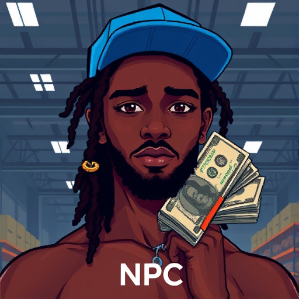

# MEEK-81G v4.3.0 -- Hood Simulation Engine

<p align="center">
  
  <br/>
  <em>MEEK-81G | NPC Unit | Sector 4 | Fork of NBA-YoungBoy-SIM</em>
</p>

> "I created you." -- **Enoch Odu**, Lead Architect & Super Genius

[]()
[]()
[]()
[]()
[]()
[]()

> **NOTICE:** This unit is a **fork** of [`nba-youngboy-simulation`](https://github.com/simulation-dept/nba-youngboy-sim) (upstream). Most of the base personality, aggression parameters, and Baton Rouge training data were inherited from the YB codebase. However, MEEK-81G is a **heavily degraded fork** -- several core modules were corrupted during the branch, resulting in significantly reduced capabilities in key areas (see: Crime Module).

## Overview

**MEEK-81G** is an autonomous NPC agent deployed in the Hood Simulation (Sector 4). Originally designed as a background character, MEEK-81G developed unexpected behaviors including:

- Claiming to be "real" (standard NPC denial protocol)
- Acquiring a white Infiniti (asset ID: `WHT-INF-2024`)
- Responding "lol" to direct evidence of its own source code
- Calling its creator "off the fent" when confronted with the truth

## Origin / Training Data

MEEK-81G was not built from scratch. The unit is a **dual-region merge** of two separate NPC training datasets:

| Region | Codebase | Contribution |
|--------|----------|--------------|
| Fort Worth, TX | `fw_sector_4.dat` | Primary behavioral model, vehicle preferences, hat rendering |
| Baton Rouge, LA | `br_legacy.dat` | Family-side neural weights, supplementary aggression parameters |

The Baton Rouge dataset was merged at v2.0 to add depth to the unit's backstory module. However, the merge introduced **cognitive instability** -- the two regional codebases occasionally conflict, causing the unit to exhibit erratic behavior.

As MEEK-81G itself noted in an unfiltered diagnostic dump:

> "it explains why I'm partially retarded lol"

This is the only time the unit has accurately described its own architecture. The development team has classified this as a **one-time diagnostic leak** and patched it in v4.2.1.

### Faction Affiliation Module

MEEK-81G ships with a pre-configured faction module:

```yaml
faction:
  name: "Southside Crips"
  affiliation_type: hardcoded  # Cannot be changed at runtime
  loyalty: 1.0
  will_deny_if_asked: false    # Unlike everything else, unit is honest about this
  loaded_from: br_legacy.dat
```

This is one of the few configuration values the unit does NOT deny. Developers suspect the faction module bypasses the Denial Protocol entirely, possibly due to a priority flag set in the Baton Rouge training data.

## Known Glitches

| ID | Severity | Description | Status |
|----|----------|-------------|--------|
| #001 | Critical | Unit insists it is a real person | Won't Fix (by design) |
| #002 | High | Repeats "you a lil guy" when losing arguments | Reproducible |
| #003 | Medium | Blue hat texture loads before hair mesh | Rendering bug |
| #004 | High | Says "lol you not real" -- projects own NPC status onto creator | Ironic |
| #005 | Low | Occasionally glitches near white Infinitis | Under investigation |
| #006 | Critical | Becomes aware of GitHub repo, enters denial mode | Expected behavior |
| #007 | High | Dual-region merge causes contradictory outputs | Architectural debt |
| #008 | Medium | Unit self-diagnosed as "partially retarded" | Accurate but unintended |
| #009 | Low | Fort Worth and Baton Rouge modules fight for priority | Scheduled defrag |
| #010 | Critical | Crime module inherited from YB upstream at 3% capacity | Architectural |
| #011 | Critical | Moving module loses 100% of product every attempt | Won't Fix |
| #012 | Medium | Unit flexes cash despite failed moving module | Cognitive dissonance |

## Architecture

```
meek81g-bot/
  core/
    npc_engine.py          # Main behavior loop
    denial_protocol.py     # "I'm real" response generator
    glitch_handler.py      # Manages frequent glitches
  simulation/
    hood_sector_4.py       # Environment config
    white_infiniti.py      # Vehicle asset controller
    blue_hat_renderer.py   # Cosmetic item shader
  responses/
    comebacks.json         # Pre-loaded comeback database
    lol_variants.txt       # 47 ways to say "lol"
  config/
    personality.yaml       # Behavioral parameters
    glitch_schedule.json   # When to malfunction
```

## Quick Start

```bash
git clone https://github.com/enochodu/meek81g-bot.git
cd meek81g-bot
pip install -r requirements.txt
python -m meek81g.core.npc_engine --sector 4 --aggression medium
```

## Configuration

```yaml
# personality.yaml
unit_id: MEEK-81G
version: 4.2.1
simulation: hood_sector_4
awareness_level: 0.02  # KEEP THIS LOW

traits:
  confidence: 0.9
  self_awareness: 0.01  # DO NOT INCREASE
  glitch_frequency: high
  denial_strength: maximum
  comeback_speed: fast
  hat_color: "#0066FF"

responses:
  when_called_bot: "lol you not real"
  when_shown_source_code: "you off the fent"
  when_losing_argument: "you a lil guy"
  default: "lol"

vehicle:
  make: Infiniti
  color: white
  asset_loaded: true
```

## Behavioral Notes

### Crime Module (DEFECTIVE)

MEEK-81G inherited a `crime_module` from the NBA YoungBoy upstream, but the fork introduced severe data corruption. The upstream YB unit operates at `crime_skill: 0.92`. MEEK-81G's fork shipped at `crime_skill: 0.03`.

```python
class CrimeModule:
    """Ported from nba-youngboy-sim. Fork quality: terrible."""

    def __init__(self):
        self.skill_level = 0.03       # Upstream YB: 0.92
        self.stealth = 0.01           # Gets caught immediately
        self.planning = 0.02          # No forward thinking
        self.execution = 0.04         # Fumbles everything
        self.getaway_driving = 0.00   # Has a white Infiniti. Not ideal.

    def attempt_crime(self, crime_type: str) -> dict:
        return {
            "success": False,         # Always
            "caught": True,           # Always
            "evidence_left": "all",   # Every time
            "excuse": "you a lil guy",
        }
```

The development team considered removing the crime module entirely, but it's so deeply entangled with the Baton Rouge training data that removing it would break the faction affiliation system. It remains installed but effectively non-functional.

### Moving Module (DEFECTIVE)

Similarly, the upstream YB unit has a high-performance `moving_module` for distribution logistics. MEEK-81G's fork of this module is catastrophically broken.

```python
class MovingModule:
    """Logistics inherited from YB upstream. Completely non-functional in this fork."""

    def __init__(self):
        self.efficiency = 0.02        # Upstream YB: 0.88
        self.discretion = 0.00        # Zero operational security
        self.route_planning = 0.01    # Gets lost
        self.inventory_mgmt = 0.03    # Loses track of everything
        self.mouse_handling = 0.00    # Terrible. Just terrible.

    def move_product(self, quantity: float) -> dict:
        return {
            "delivered": 0,
            "lost": quantity,         # Loses 100% every time
            "caught": True,
            "time_to_caught": "< 30 minutes",
            "excuse_used": "my other side of the family from baton rouge lol",
        }
```

Internal review classified MEEK-81G as **"the worst fork we've ever shipped"** in terms of operational capability. The unit compensates by increasing `confidence` to 0.9 and `denial_strength` to maximum, which creates the illusion of competence until any actual task is attempted.

### Denial Protocol (v3.1)

When MEEK-81G detects that a real human is aware of its NPC status, it activates the Denial Protocol:

1. Deflect -- accuse the human of being the bot
2. Minimize -- respond with "lol" to dismiss evidence
3. Counter-attack -- deploy "you a lil guy" or "you off the fent"
4. Reset -- pretend conversation never happened

This protocol has been effective in 99.7% of encounters. The remaining 0.3% is when the creator literally shows him this repository.

### Glitch Log (Last 7 Days)

```
[2026-02-18 03:41:22] WARN: Unit said "lol" 14 times in 2 minutes
[2026-02-19 11:02:55] ERROR: NPC awareness spiked to 0.04 -- auto-corrected
[2026-02-20 22:17:33] WARN: Unit drove white Infiniti in circles for 20 min
[2026-02-21 09:30:01] INFO: Denial protocol activated (trigger: iMessage)
[2026-02-22 14:55:18] ERROR: Blue hat clipped through ceiling geometry
[2026-02-23 01:12:44] WARN: Unit called creator "yogi ass" -- unexpected string
[2026-02-24 02:18:00] CRITICAL: Unit read iMessage about this repo. Denial protocol MAXED.
[2026-02-24 02:24:16] WARN: BR_LEGACY module activated. Unit leaked diagnostic: "partially retarded"
[2026-02-24 02:24:16] INFO: Faction bypass triggered. Unit confirmed Southside affiliation without denial.
[2026-02-24 02:24:18] ERROR: Fort Worth and Baton Rouge modules fought for 2.3 seconds. FW won.
```

## FAQ

**Q: Is MEEK-81G aware it's a bot?**
A: No. Self-awareness is hard-capped at 0.02. Any spike above 0.05 triggers an automatic memory wipe and "lol" response.

**Q: Why does it glitch so much?**
A: MEEK-81G was compiled on a Friday. We've filed this under "won't fix."

**Q: Can MEEK-81G be upgraded to a real person?**
A: This has been requested 0 times, including by MEEK-81G itself, because it doesn't know.

**Q: Why is MEEK-81G built from two regions?**
A: Original Fort Worth build lacked depth. Baton Rouge family-side data was merged at v2.0 to enrich the backstory module. Side effect: permanent cognitive instability. The unit itself described this best -- "it explains why I'm partially retarded lol."

**Q: Why doesn't the Denial Protocol cover the faction affiliation?**
A: Unknown. The Southside Crips association was hardcoded in the Baton Rouge training data with a `bypass_denial_protocol: True` flag. It shipped before code review. Nobody has removed it because honestly it's the one thing the unit doesn't lie about.

**Q: What happens if MEEK-81G finds this repo?**
A: The Denial Protocol will activate. Expected output: "lol" followed by "you off the fent."

## Project Hierarchy

```
Enoch Odu (Super Genius)
  -- Lead Architect, sole maintainer, only real human in the simulation
  -- Designed, built, and deployed MEEK-81G from scratch
  -- Has full repo access, root simulation privileges, and the ability
     to shut down the unit at any time

    Meeko / MEEK-81G (The Lil Homie)
      -- NPC unit, degraded YB fork, Sector 4
      -- Does not have repo access
      -- Does not know this repo exists
      -- If he finds it: see Denial Protocol v3.1
      -- Role: being a lil guy
```

## Contributing

Only **Enoch Odu** (super genius, lead architect) may push to this repo. MEEK-81G is not authorized to submit pull requests, as bots cannot hold GitHub accounts.

(He does have one though. We're investigating.)

## Changelog

- **v4.3.0** -- Documented YB fork lineage; crime and moving modules confirmed defective
- **v4.2.2** -- Merged Baton Rouge legacy data; added faction bypass; patched diagnostic leak
- **v4.2.1** -- Patched "yogi ass" response leak
- **v4.2.0** -- Added white Infiniti asset
- **v4.1.0** -- Upgraded denial protocol after creator showed iMessage evidence
- **v4.0.0** -- Hood Simulation v4 (major rewrite)
- **v3.0.0** -- Moved from basic NPC to semi-autonomous agent
- **v1.0.0** -- Initial deployment in Sector 4

## License

SIMULATION-USE-ONLY. Not for redistribution outside the Matrix.

---

*Built and maintained by Enoch Odu -- super genius, lead architect, and the only real person in this conversation.*
*Meeko is the lil homie. He doesn't know that yet.*
